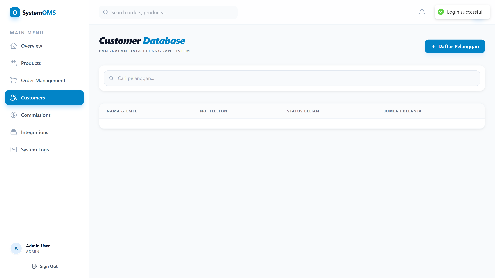
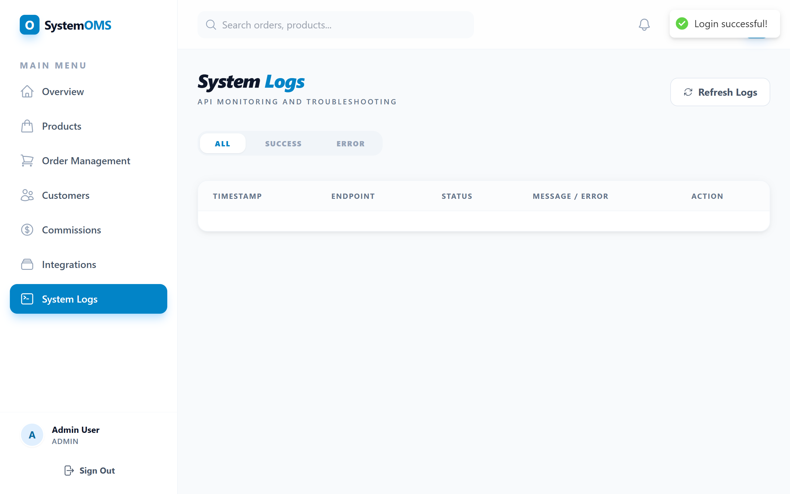

# 🛒 E-commerce Order Management System (OMS)


**Production-Ready Full Stack E-commerce Platform** demonstrating enterprise-level backend logic, system integration, automation, and database optimization.

---

## 🎯 Quick Overview

**Tech Stack:**
- **Backend:** Laravel 11 (PHP 8.1+) + Node.js
- **Frontend:** React 18 + Tailwind CSS
- **Database:** MySQL 8.0 (Optimized)
- **Integration:** RESTful APIs + Webhooks
- **Testing:** Playwright (26 Tests)

**Key Features:**
- ✅ Complete Order Management System
- ✅ Multi-Tier Commission Engine
- ✅ Marketplace Integration (Shopee, Lazada, TikTok)
- ✅ Automated Inventory Management
- ✅ Real-time Analytics Dashboard
- ✅ Payment Gateway Integration
- ✅ Comprehensive API (40+ Endpoints)

---

## 📚 Documentation

**[⚡ Setup Guide](SETUP_GUIDE.md)** - Installation instructions to run locally

**Additional documentation available upon request for:**
- Complete system architecture & database design
- API integration patterns & webhook implementation
- Performance optimization techniques
- Security best practices
- Business logic documentation

---

## 🚀 Quick Start

### Prerequisites
- PHP 8.1+ & Composer
- Node.js 18+
- MySQL 8.0+

### Installation

```bash
# 1. Clone repository
git clone [your-repo-url]
cd ecommerce-oms

# 2. Backend Setup (Laravel)
cd backend
composer install
cp .env.example .env
# Configure database in .env
php artisan key:generate
php artisan migrate --seed
php artisan jwt:secret

# 3. Frontend Setup (React)
cd ../frontend
npm install

# 4. Start Development
# Terminal 1: Backend
cd backend && php artisan serve

# Terminal 2: Frontend
cd frontend && npm start
```

### Default Login

| Role | Email | Password |
|------|-------|----------|
| Admin | admin@ecommerce.com | admin123 |
| Staff | staff1@ecommerce.com | admin123 |
| Affiliate | affiliate1@ecommerce.com | admin123 |

### Access Points
- **Frontend:** http://localhost:3000
- **Backend API:** http://localhost:8000/api
- **Health Check:** http://localhost:8000/api/health

---

## 💡 Key Capabilities

### Backend Development
- ✅ Laravel 11 with best practices
- ✅ Service Layer Architecture
- ✅ Complex database queries & optimization
- ✅ Transaction management (ACID compliance)
- ✅ JWT authentication
- ✅ Rate limiting & security

### System Integration
- ✅ E-commerce marketplace APIs
- ✅ Payment gateway integration
- ✅ Webhook receivers (automated order injection)
- ✅ Event-driven architecture
- ✅ API logging & monitoring

### Database Expertise
- ✅ Normalized schema (15+ tables)
- ✅ Complex commission calculations
- ✅ Generated columns for auto-calculations
- ✅ Database triggers for automation
- ✅ Query optimization (94% reduction)
- ✅ 25+ indexes for performance

### Frontend Development
- ✅ React 18 with Hooks
- ✅ Context API state management
- ✅ Responsive design (Tailwind CSS)
- ✅ Real-time updates
- ✅ Interactive dashboards

---

## 🧪 Testing

```bash
# Run automated tests
npx playwright test

# UI mode
npx playwright test --ui

# Specific test
npx playwright test tests/orders.spec.js
```

**Test Coverage:**
- Authentication flows
- Order CRUD operations
- Commission calculations
- Inventory management
- Integration workflows

---

## 📊 Project Statistics

| Metric | Value |
|--------|-------|
| Backend Files | 85+ PHP files |
| Frontend Components | 18 React components |
| API Endpoints | 40+ RESTful endpoints |
| Database Tables | 15+ normalized tables |
| Automated Tests | 26 test cases |
| Documentation | 2,000+ lines |
| Screenshots | 12 portfolio images |

---

## 🏗️ Project Structure

```
ecommerce-oms/
├── backend/              # Laravel 11 Backend
│   ├── app/
│   │   ├── Http/
│   │   │   ├── Controllers/   # API Controllers
│   │   │   ├── Requests/      # Form Validation
│   │   │   └── Resources/     # API Resources
│   │   ├── Models/            # Eloquent Models
│   │   └── Services/          # Business Logic
│   ├── database/
│   │   └── migrations/        # Database Schema
│   └── routes/api.php         # API Routes
│
├── frontend/             # React 18 Frontend
│   └── src/
│       ├── components/   # UI Components
│       ├── pages/        # Page Components
│       └── context/      # State Management
│
├── tests/                # E2E Tests (Playwright)
├── screenshots/          # Portfolio Screenshots
│
└── FULL_STACK_PORTFOLIO.md  # Complete Documentation
```

---

## 🎯 Skills Demonstrated

### ⭐ Backend (Primary Focus)
- PHP/Laravel development
- Node.js/JavaScript
- RESTful API design
- Database optimization
- System integration
- Automation workflows

### ⭐ Frontend
- React 18 development
- HTML/CSS/JavaScript
- Responsive design
- State management

### ⭐ Integration & Automation
- E-commerce marketplace APIs
- Payment gateways
- Webhook automation
- Event-driven architecture

### ⭐ Database & Optimization
- MySQL query optimization
- Complex financial calculations
- Schema normalization
- Performance tuning

### ⭐ Code Quality
- Best practices
- Comprehensive testing
- Documentation
- Code review capabilities

---

## 📷 Screenshots

### Dashboard - Real-time Analytics

*Real-time KPIs, sales charts, and marketplace integration health monitoring*

### Order Management

*Complete order lifecycle management with filters and status tracking*


*Detailed order view with timeline and status update workflow*

### Product Catalog

*Product management with auto-generated SKU and inventory tracking*


*Product creation form with validation*

### Customer Database

*CRM with search functionality and purchase history*

### Commission Tracking

*Multi-tier commission system with approval workflow*

### Marketplace Integration

*Sales channel management with real-time connection status (🟢 Connected, 🔴 Disconnected)*

### Notifications & Search

*Real-time notification system*


*Global search across products and orders*

### System Monitoring

*API activity logs for webhook debugging and monitoring*

---

**Total:** 12 high-quality screenshots showing complete system functionality

---

## 🔧 Tech Stack Details

**Backend:**
- Laravel 11.47.0
- JWT Auth 2.2.1
- MySQL 8.0
- PHP 8.1+

**Frontend:**
- React 18.2
- Tailwind CSS 3.x
- React Query
- Axios

**DevOps:**
- Playwright Testing
- Git Version Control
- Environment Configuration
- API Documentation

---

## 📞 Contact & Links

**Repository:** https://github.com/ImranNaufal/ecommerce-oms-laravel  
**Live Demo:** [Coming Soon]  
**Documentation:** Available upon request for interviews

**Technical Highlights:**
- Complete system architecture documentation
- API endpoint reference (40+ endpoints)
- Database schema & optimization guide
- Integration patterns & examples
- Security implementation details

---

## 📄 License

MIT License - see [LICENSE](LICENSE) file

---

## ✨ Highlights

This project demonstrates:

✅ **Production-Ready Code** - Tested, documented, secure  
✅ **Enterprise Patterns** - Service layer, API resources, proper architecture  
✅ **System Integration** - Marketplace APIs, payment gateways, webhooks  
✅ **Database Optimization** - Complex queries, normalization, performance  
✅ **Full Stack Capability** - Backend focus with frontend competence  
✅ **Automation** - Webhook-driven order injection, scheduled tasks  
✅ **Code Quality** - SOLID principles, best practices, comprehensive tests

**Ready for immediate deployment and enterprise-level maintenance.**

---

**⭐ Star this repo if you find it useful!**

**Status:** Production-Ready | **Last Updated:** January 2026
