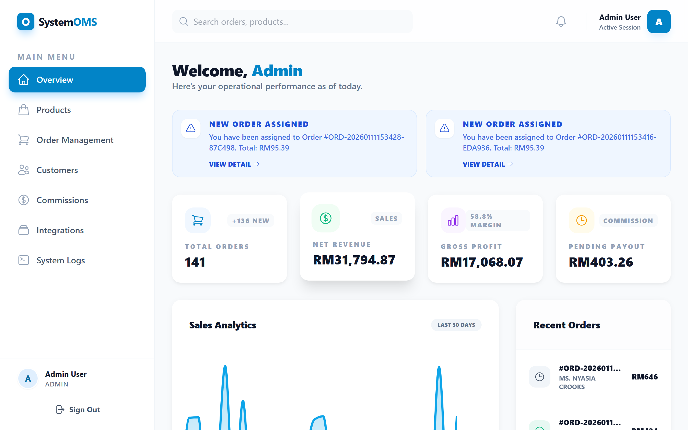
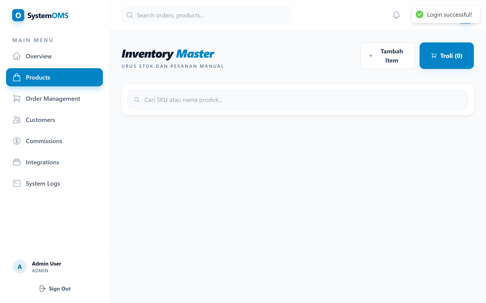
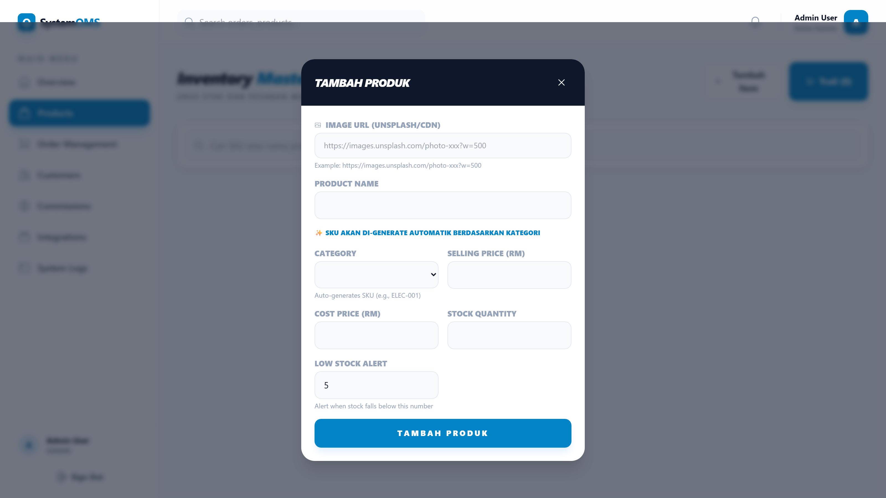
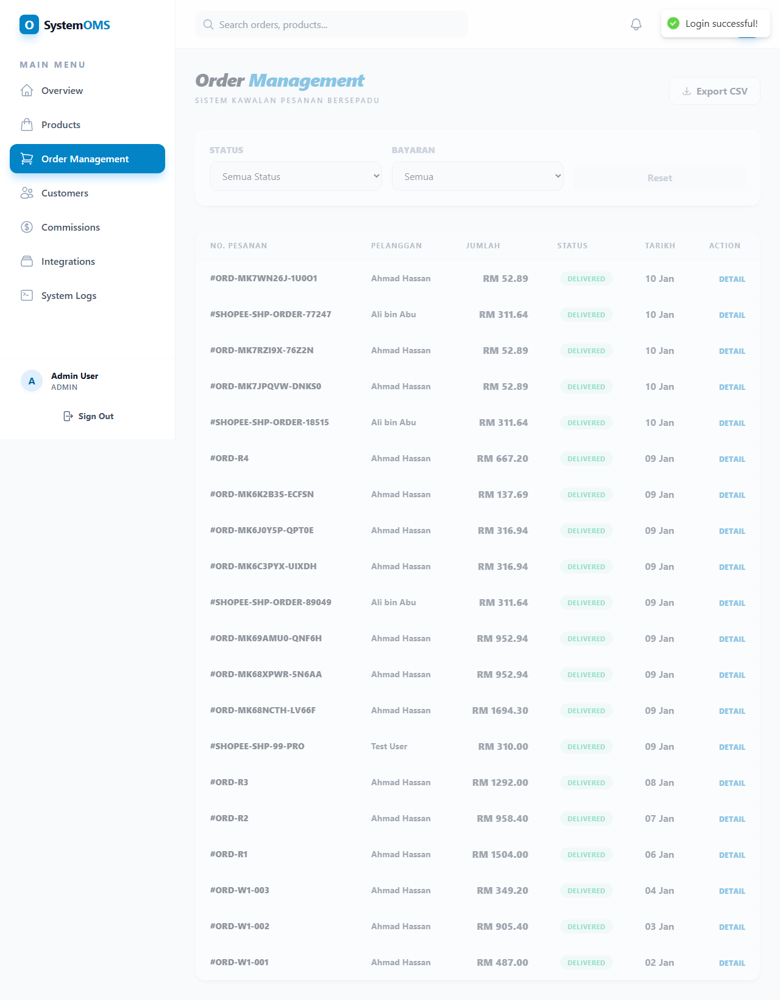
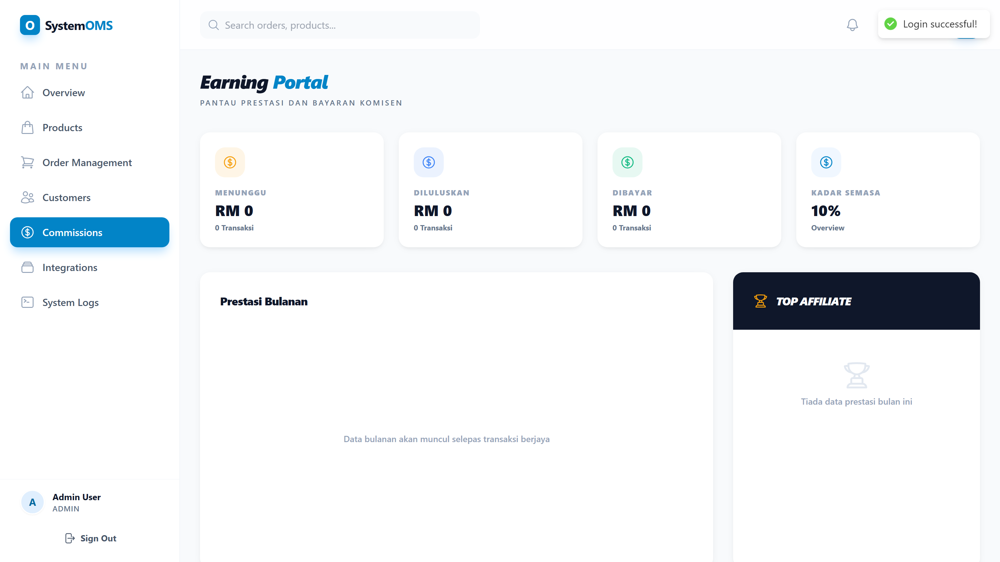
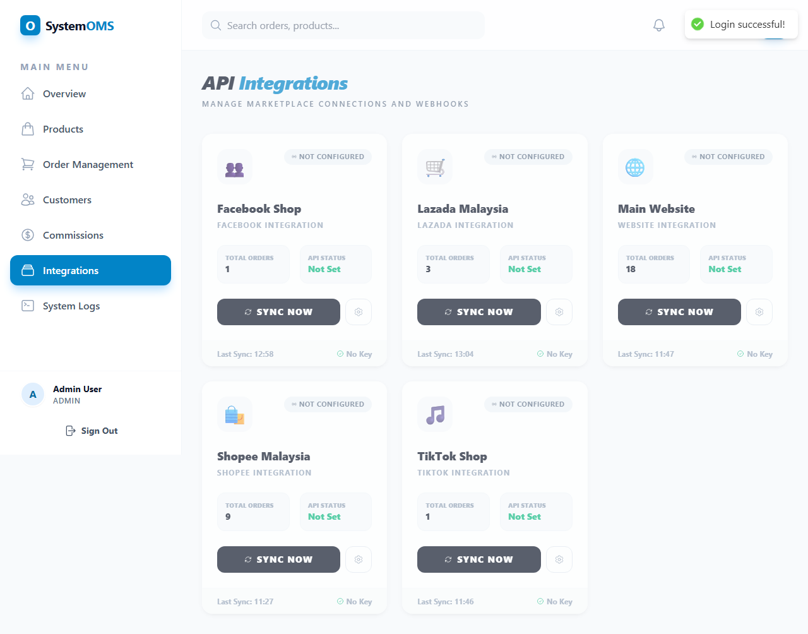
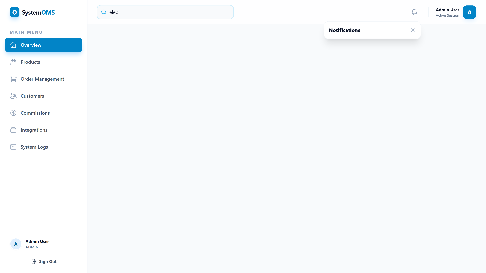
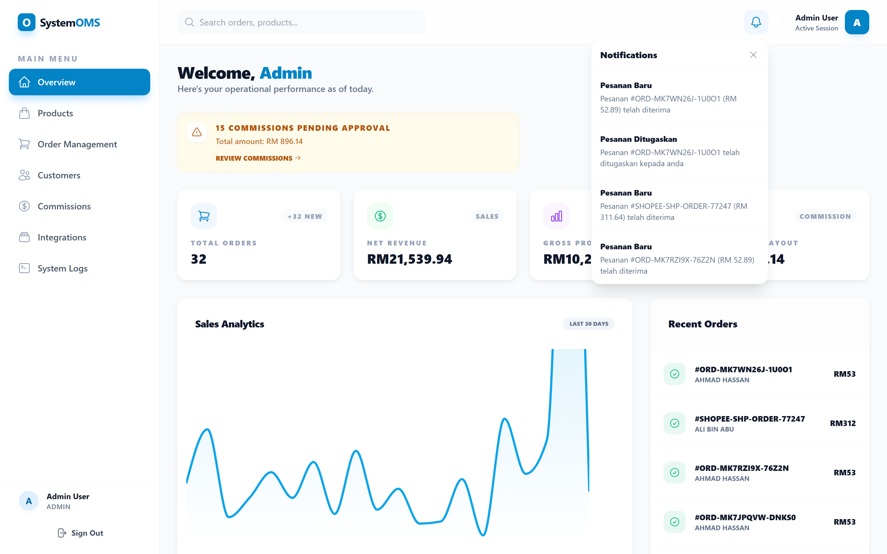

# 🛒 Full Stack E-commerce Order Management System (OMS)


A comprehensive, production-ready e-commerce platform featuring an advanced Order Management System (OMS) built with **Laravel 11** and **React 18**. Features include automated commission tracking for staff/affiliates, multi-channel marketplace integration via webhooks, and real-time analytics dashboards.

## 🎯 Architecture Overview

This project follows a modern decoupled architecture:
- **Backend:** Laravel 11 (PHP 8.2+) providing a secure, high-performance RESTful API.
- **Frontend:** React 18 with Tailwind CSS, React Query for data fetching, and Recharts for analytics.
- **Database:** MySQL 8.0 with optimized schema, generated columns, and triggers.

## ✨ Core Features

### 🎯 Key Functionality
- **Order Management System (OMS):** Manage the complete order lifecycle from 'Pending' to 'Delivered'.
- **Automated Commission Engine:** Sophisticated, multi-tier commission calculation with a built-in approval workflow.
- **Multi-Channel Integration:** Ingest orders from Shopee, Lazada, TikTok, and other marketplaces via webhooks.
- **Real-time Notifications:** Database-triggered alerts for critical events like low stock or new external orders.
- **Inventory Management:** Automatic stock deduction upon order creation with low-stock alerts.
- **Customer Database:** Maintain a comprehensive history of customer orders and statistics.
- **Sales Analytics:** Interactive charts to analyze sales trends and revenue performance.
- **Financial Reporting:** In-depth profit analysis and commission leaderboard.

### 💼 Business & Operational Features
- **Security First:** Implemented with 10-layer defense including rate limiting, security headers (Anti-XSS/Anti-Clickjacking), and strict RBAC.
- **Role-Based Access Control (RBAC):** Roles for 'Admin', 'Staff', and 'Affiliate' users.
- **Commission Approval Workflow:** Pending -> Approved -> Paid status tracking.
- **Order Audit Trail:** Tracks all changes to an order for compliance.
- **API Activity Logging:** Monitors all incoming webhook requests for easy troubleshooting.

## 📸 Screenshots

### 🖥️ Dashboard & Analytics
Interactive sales analytics with real-time statistics and zoom-enabled charts.


### 📦 Product Management
Modern grid layout for products with profit margin badges and SKU generation.



### 🧾 Order & Customer Management
Full order lifecycle tracking and comprehensive customer history.



### 💰 Commissions & Integrations
Automated commission tracking and multi-channel marketplace integration.



### 🔍 Search & Notifications
Global real-time search and database-triggered notification system.



## 🚀 Quick Start Guide

### Prerequisites
- Node.js (v18 or higher)
- PHP (v8.2 or higher) & Composer
- MySQL (v8.0 or higher)

### Installation Steps

```bash
# 1. Clone the repository
git clone https://github.com/ImranNaufal/ecommerce-oms-laravel.git
cd ecommerce-oms-laravel

# 2. Setup Backend (Laravel)
cd backend
composer install
cp .env.example .env
# Configure your DB credentials in .env
php artisan key:generate
php artisan migrate --seed
php artisan jwt:secret
cd ..

# 3. Setup Frontend (React)
cd frontend
npm install
cd ..

# 4. Start Development Environment
npm run dev
```

### Default Login Credentials

| Role | Email | Password |
|---|---|---|
| Administrator | `admin@ecommerce.com` | `admin123` |
| Staff | `staff1@ecommerce.com` | `admin123` |
| Affiliate | `affiliate1@ecommerce.com` | `admin123` |

### Access Points
- **Frontend Application:** [http://localhost:5000](http://localhost:5000)
- **Backend API:** `http://localhost:8000/api`
- **API Health Check:** `http://localhost:8000/api/health`

## 📚 Project Documentation

| Document | Description |
|---|---|
| [API Documentation](API_DOCUMENTATION.md) | Complete reference for all API endpoints. |
| [Setup Guide](SETUP_GUIDE.md) | Detailed installation and configuration instructions. |
| [Project Overview](PROJECT_OVERVIEW.md) | Architectural details and file structure. |
| [Security Guide](SECURITY.md) | Security implementation and best practices. |
| [Marketplace Integration](HOW_TO_ADD_MARKETPLACE_API.md) | Guide for connecting Shopee, Lazada, etc. |
| [Contributing Guide](CONTRIBUTING.md) | Guidelines for developers. |

## 🧪 Testing

The project includes automated end-to-end tests using Playwright.

```bash
# Run tests
npx playwright test

# Run tests in UI mode
npx playwright test --ui
```

## 📄 License

This project is licensed under the MIT License - see the [LICENSE](LICENSE) file for details.